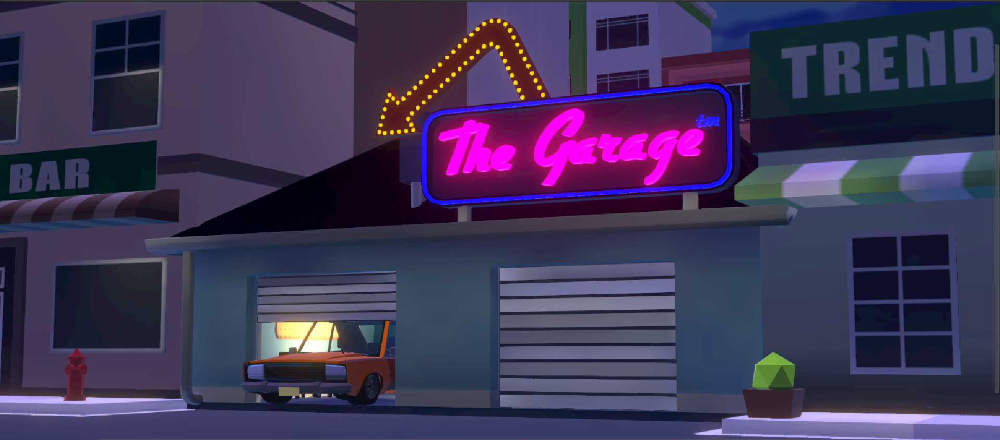
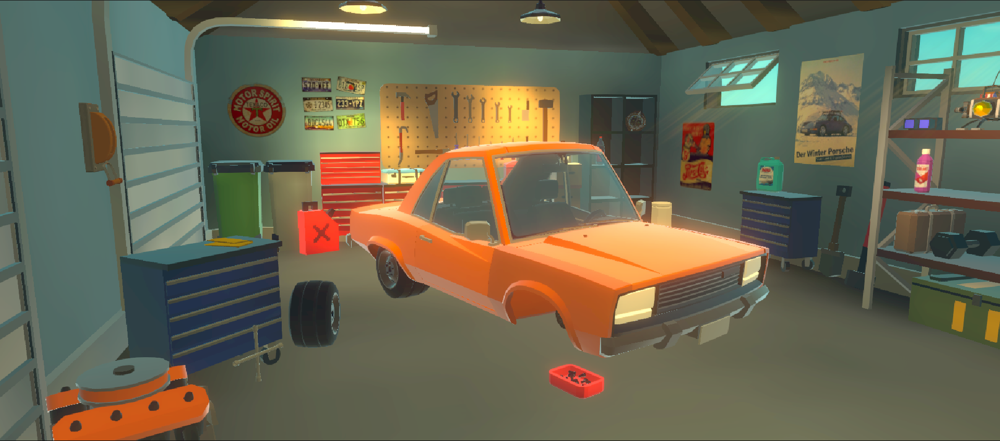

<h1 align="center"  style="font-family: 'Roboto', sans-serif; font-size: 60px; font-weight: bold; color: #FFF; text-shadow: 2px 2px 4px rgba(0,0,0,0.3);">
 
   
 The Garage
</h1>

---

*(There is also a README.txt, but this file is a bit nicer to look at)*

## Description
The aim of our project was to develop a VR-Experience in which players would learn basic tasks concerning car-maintenance. During the game, players would be able to learn tasks like changing a tire, refilling coolant, etc in an accessible and interactive manner. By using Virtual Reality, this could create a safe and realistic environment in which the player could practice these skills while not being afraid to make expensive or dangerous mistakes.

The setting of the game is a simple and cozy home garage, where the user has many car maintenance items at their disposal, which they could realistically have at home. Furthermore, during the game the player will be guided by a narrator, telling them what to do and how to do it safely. Overall, The Garage provides an engaging and educational VR experience that allows players to build confidence in essential car maintenance skills, all within a safe and immersive environment.

## Group F

### Team Members
- **Stephan Visser** *(13977571)*
  - Made everything concerning the Mechanics: Fluids, Jumpstarter, Wheel Replacement, Bonet Interior (+ the other decoration items like basketball)
  - Modelled all 3D objects (Safe for some store assets)
  - Implemented the AI voice generation
  - Made the main scene Environment
  - Implemented all lighting, particle effects and Post Processing
  - Wrote the Fluid shaders
  - Edited the Video
- **Remolo van de Plasse** *(14648903)*
  - Implemented hinges on the car (Hood, trunk, doors)
  - Implemented locking of the hood
  - Designed and implemented every UI element
  - Designed the instructions on the white board
  - Created the narration system (goals & voice lines)
  - Many small changes to the XR interaction system (grabbing, raycasting, etc)
- **Duco Trompert** *(14591227)*
  - Implemented GameStateManager for managing tasks and game state.
  - Designed the starting scene environment
  - Added object highlighting when objects are grabbable
  - Leaderboard manager (not implemented nor finished)
- **Thomas Apotheker** *(???????)*
  - Modelled the Krik
  - Made the krik Mechanic
  - Recorded the video
